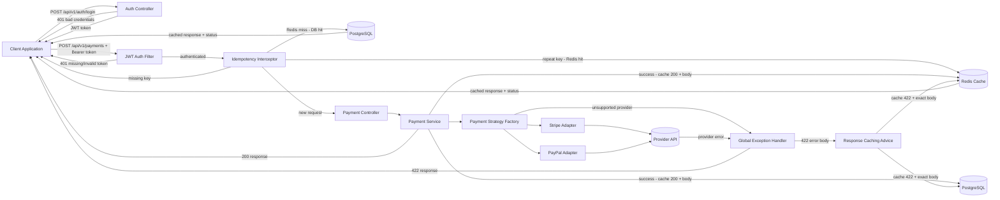

# Multi-Tenant Payment Gateway Middleware

## Project Description
This project is a Spring Boot based middleware for processing multi-tenant card payments through pluggable providers. It includes JWT authentication, provider routing, idempotency protection, request validation, and normalized error handling to support fintech-grade API behavior. The application is fully containerized with Docker Compose, wiring the Spring Boot app, PostgreSQL, and Redis together.

## Architecture Diagram


## Project Evidence For Recruiters
| File or Folder | Purpose | What it shows a recruiter |
|---|---|---|
| README.md | Installation guide, architecture view, and feature verification flow. | Technical communication and system design clarity. |
| DEBUGGING.md | Ledger of production-style root causes and corrective actions. | Structured debugging and resilient problem-solving. |
| pom.xml | Dependency and plugin management for Spring Boot 3.2 stack. | Strong Java ecosystem and build tooling competence. |
| Dockerfile | Multi-stage Docker image build (Maven build + JRE runtime). | Container-first deployment discipline. |
| docker-compose.yml | Orchestrates app + PostgreSQL + Redis with health checks. | Production-style infrastructure-as-code. |
| postman/ | 22-test collection using EP, BVA, and error guessing techniques. | Systematic test design and full API coverage mindset. |

## Technology Stack
- Java 17
- Spring Boot 3.2
- Spring MVC + WebFlux WebClient
- Spring Data JPA
- PostgreSQL (Docker runtime)
- H2 (local/in-memory development only)
- Redis (idempotency cache)
- Docker + Docker Compose
- Maven

## Design Patterns
- Interceptor Pattern: Idempotency request firewall
- Strategy Pattern: Dynamic payment provider selection
- Adapter Pattern: Provider-specific request/response mapping
- DTO Pattern: API contract boundaries
- Builder Pattern: DTO and entity object construction
- Advisor Pattern: `ResponseBodyAdvice` captures exact serialized error body for idempotency cache consistency

## Prerequisites
- Java 17
- Maven 3.8+
- Docker Desktop

## Build and Run

### Docker (recommended)
```bash
docker compose up --build
```
This starts the Spring Boot app, PostgreSQL, and Redis. The app is available at `http://localhost:8080`.

### Local (H2, no Docker)
```bash
mvn clean install
mvn spring-boot:run
```

## Feature Highlights
- JWT authentication with stateless Bearer token validation; 401 on bad or missing credentials
- Multi-tenant payment processing with case-insensitive provider routing strategy
- Idempotency protection: caches both success (200) and error (422) responses with exact byte fidelity — retries receive identical responses including timestamps
- Validation-first API contract using DTO constraints with normalized error responses
- Centralized exception handling with structured `errorCode` + `message` + `timestamp` envelope
- Adapter-based provider integration for Stripe and PayPal with circuit breaker timeout handling

## H2 Console (local mode only)
Only available when running with `mvn spring-boot:run`. Not available in Docker (uses PostgreSQL).
- URL: http://localhost:8080/h2-console
- JDBC URL: jdbc:h2:mem:paymentgateway
- Username: sa
- Password: (leave blank)

## Postman Collection
Import both files from the `postman/` folder:
- `Multi-Tenant-Payment-Gateway.postman_collection.json`
- `Multi-Tenant-Payment-Gateway.local.postman_environment.json`

Select the **Multi-Tenant Payment Gateway - Local** environment before running. Run requests in order — A1 (Login) must run first to populate the `{{token}}` variable.

## API Reference — 22 Postman Verification Tests

### AUTH

#### A1 - Login valid credentials
- `POST /api/v1/auth/login?username=admin&password=admin123`
- Expected: HTTP 200, `{"token": "<jwt>"}`

#### A2 - Login wrong password (EP: invalid credentials)
- `POST /api/v1/auth/login?username=admin&password=wrongpass`
- Expected: HTTP 401

#### A3 - Login unknown user (EP: non-existent user)
- `POST /api/v1/auth/login?username=ghost&password=anything`
- Expected: HTTP 401

### SECURITY

#### S1 - No Authorization header
- `POST /api/v1/payments` with no `Authorization` header
- Expected: HTTP 401

#### S2 - Invalid/malformed JWT token
- `POST /api/v1/payments` with `Authorization: Bearer invalid.jwt.token`
- Expected: HTTP 401

### IDEMPOTENCY

#### I1 - Missing Idempotency-Key header
- `POST /api/v1/payments` with no `Idempotency-Key` header
- Expected: HTTP 400, `{"error": "Idempotency-Key header is required"}`

#### I2 - First payment request (new key)
- `POST /api/v1/payments` with `Idempotency-Key: idem-test-002`
- Expected: HTTP 200 or 422 (provider-dependent); response body saved for I3 comparison

#### I3 - Duplicate request (short-circuit cache hit)
- Same request as I2 with same `Idempotency-Key: idem-test-002`
- Expected: HTTP status and body byte-for-byte identical to I2, served from cache

### VALIDATION — Boundary Value Analysis

| Test | Field | Input | Expected |
|------|-------|-------|----------|
| V1 | merchantId | `""` (blank) | 400 VALIDATION_ERROR |
| V2 | amount | `0.00` (below min) | 400 VALIDATION_ERROR |
| V3 | amount | `-1.00` (negative) | 400 VALIDATION_ERROR |
| V4 | amount | `0.01` (exact min) | 200 or 422 (valid — passes validation) |
| V5 | currency | `"US"` (2 chars) | 400 VALIDATION_ERROR |
| V6 | currency | `"USDD"` (4 chars) | 400 VALIDATION_ERROR |
| V7 | cardDetails | `null` | 400 VALIDATION_ERROR |
| V8 | cardDetails.holderName | `""` (blank) | 400 VALIDATION_ERROR |
| V9 | multiple | merchantId blank + amount negative + currency 2 chars | 400 VALIDATION_ERROR, all fields listed |

### PROVIDER ROUTING

#### P1 - Stripe (EP: valid provider)
- `targetProvider: "STRIPE"` — Expected: HTTP 200 or 422

#### P2 - PayPal (EP: valid provider)
- `targetProvider: "PAYPAL"` — Expected: HTTP 200 or 422

#### P3 - Lowercase provider name (EP: case-insensitive routing)
- `targetProvider: "stripe"` — Expected: HTTP 200 or 422 (routing accepts any case)

#### P4 - Unsupported provider (EP: unknown provider)
- `targetProvider: "UNKNOWN_BANK"` — Expected: HTTP 422, `errorCode: PAYMENT_PROCESSING_ERROR`, message contains `UNKNOWN_BANK`

#### P5 - Empty targetProvider (EP: blank — triggers validation before routing)
- `targetProvider: ""` — Expected: HTTP 400, `errorCode: VALIDATION_ERROR`
