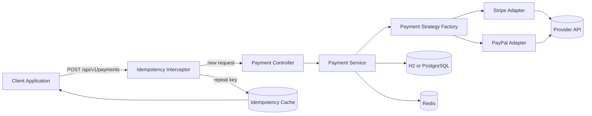

# Multi-Tenant Payment Gateway Middleware

## Project Description
This project is a Spring Boot based middleware for processing multi-tenant card payments through pluggable providers. It includes provider routing, idempotency protection, request validation, and normalized error handling to support fintech-grade API behavior.

## Architecture Diagram


## Project Evidence For Recruiters
| File or Folder | Purpose | What it shows a recruiter |
|---|---|---|
| README.md | Installation guide, architecture view, and feature verification flow. | Technical communication and system design clarity. |
| DEBUGGING.md | Ledger of production-style root causes and corrective actions. | Structured debugging and resilient problem-solving. |
| pom.xml | Dependency and plugin management for Spring Boot 3.2 stack. | Strong Java ecosystem and build tooling competence. |
| postman/ | API collection and environment exports used for endpoint validation. | Practical API testing discipline and coverage mindset. |
| src/main/java/.../security/ | JWT filter, utility, and Spring Security config. | Stateless auth implementation for fintech APIs. |
| src/main/java/.../adapter/ | Stripe and PayPal adapters with Resilience4j circuit breakers. | Fault-tolerant integration with external payment providers. |
| Dockerfile + docker-compose.yml | Containerised full-stack deployment with PostgreSQL and Redis. | Production-aware DevOps and infrastructure-as-code skills. |

## Technology Stack
- Java 17
- Spring Boot 3.2
- Spring MVC + WebFlux WebClient
- Spring Data JPA
- PostgreSQL (runtime dependency)
- H2 (local/in-memory development)
- Redis (idempotency integration point)
- Maven

## Design Patterns
- Interceptor Pattern: Idempotency request firewall
- Strategy Pattern: Dynamic payment provider selection
- Adapter Pattern: Provider-specific request/response mapping
- DTO Pattern: API contract boundaries
- Builder Pattern: DTO and entity object construction

## Prerequisites
- Java 17
- Maven 3.8+

## Build and Run
```bash
mvn clean install
mvn spring-boot:run
```

## Feature Highlights
- Multi-tenant payment processing with provider routing strategy
- Idempotency protection for safe retries on payment requests
- Validation-first API contract using DTO constraints
- Centralized exception handling with normalized error responses
- Adapter-based provider integration for Stripe and PayPal
- **JWT authentication** via Spring Security — stateless Bearer token auth on all payment endpoints
- **Resilience4j circuit breakers** on Stripe and PayPal adapters — opens after 50% failure rate, resets after 10s
- **Observability** via Spring Actuator — health, metrics, and circuit breaker state exposed at `/actuator`

## Observability
Spring Boot Actuator is enabled and exposes the following endpoints:

| Endpoint | URL | What it shows |
|---|---|---|
| Health | `/actuator/health` | App, DB, and Redis liveness; circuit breaker states |
| Metrics | `/actuator/metrics` | JVM, HTTP request, and Resilience4j circuit breaker metrics |
| Circuit Breakers | `/actuator/metrics/resilience4j.circuitbreaker.state` | Live open/closed/half-open state per provider |

In production these endpoints should be secured (e.g., restricted to an internal network or behind Spring Security's `management.endpoints` role protection).

## H2 Console
- URL: http://localhost:8080/h2-console
- JDBC URL: jdbc:h2:mem:paymentgateway
- Username: sa
- Password: (leave blank)

## Postman Export Checklist
Create and place the following files under the postman folder:

- postman/Multi-Tenant-Payment-Gateway.postman_collection.json
- postman/Multi-Tenant-Payment-Gateway.local.postman_environment.json

Recommended saved requests in the collection:

- Missing Idempotency Header
- Validation Failure
- First Successful Payment (Stripe)
- Idempotency Short-Circuit
- Unsupported Provider

## API Reference - 5 Postman Verification Calls

### Call 1 - Missing Idempotency Header
- Method: POST
- URL: http://localhost:8080/api/v1/payments
- Headers: none
- Body example:
```json
{
  "merchantId": "merchant-any",
  "amount": 10.00,
  "currency": "USD",
  "paymentMethod": "CREDIT_CARD",
  "targetProvider": "STRIPE",
  "cardDetails": {
    "holderName": "John",
    "token": "tok_test"
  }
}
```
- Expected:
  - HTTP 400
  - Body contains: {"error": "Idempotency-Key header is required"}

### Call 2 - Validation Failure
- Method: POST
- URL: http://localhost:8080/api/v1/payments
- Headers:
  - Idempotency-Key: idem-test-001
  - Content-Type: application/json
- Body:
```json
{
  "merchantId": "",
  "amount": -5.00,
  "currency": "US",
  "paymentMethod": "CREDIT_CARD",
  "targetProvider": "STRIPE",
  "cardDetails": {
    "holderName": "John",
    "token": "tok_test"
  }
}
```
- Expected:
  - HTTP 400
  - errorCode: VALIDATION_ERROR
  - message lists violated fields

### Call 3 - First Successful Payment (Stripe)
- Method: POST
- URL: http://localhost:8080/api/v1/payments
- Headers:
  - Idempotency-Key: idem-test-002
  - Content-Type: application/json
- Body:
```json
{
  "merchantId": "merch_998811",
  "amount": 250.75,
  "currency": "USD",
  "paymentMethod": "CREDIT_CARD",
  "targetProvider": "STRIPE",
  "cardDetails": {
    "holderName": "John Doe",
    "token": "tok_mock_card_visa"
  }
}
```
- Expected for fully configured Stripe sandbox:
  - HTTP 200
  - GatewayResponseDto with status: SUCCESS
- Local demo note:
  - In local/offline mode or with invalid Stripe credentials, this may return a PaymentProcessingException mapped to HTTP 422. That behavior is expected and confirms provider error handling.

### Call 4 - Idempotency Short-Circuit
- Method: POST
- URL: http://localhost:8080/api/v1/payments
- Headers:
  - Idempotency-Key: idem-test-002
  - Content-Type: application/json
- Body:
  - Use the exact same body as Call 3
- Expected:
  - HTTP 200
  - Response body byte-for-byte identical to Call 3
  - Served from idempotency cache (interceptor short-circuit)

### Call 5 - Unsupported Provider
- Method: POST
- URL: http://localhost:8080/api/v1/payments
- Headers:
  - Idempotency-Key: idem-test-003
  - Content-Type: application/json
- Body:
```json
{
  "merchantId": "merch_998811",
  "amount": 250.75,
  "currency": "USD",
  "paymentMethod": "CREDIT_CARD",
  "targetProvider": "UNKNOWN_BANK",
  "cardDetails": {
    "holderName": "John Doe",
    "token": "tok_mock_card_visa"
  }
}
```
- Expected:
  - HTTP 422
  - errorCode: PAYMENT_PROCESSING_ERROR
  - message contains: Unsupported payment provider: UNKNOWN_BANK
